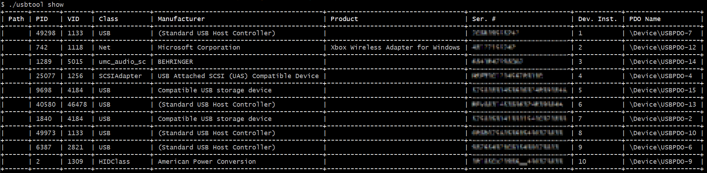

# Electric Eye
## Building
Requires: Rust Stable v1.52.1 and Windows

`cargo build --release`

## USB Tool
Command line utility for managing connected USB devices. Made this as a coding challenge submission for [NZXT](https://github.com/NZXTCorp). They liked the code but ended up not extending an offer. 😬

### Show connected USB devices
`./usbtool show`

Limitations
- Doesn't currently show device path